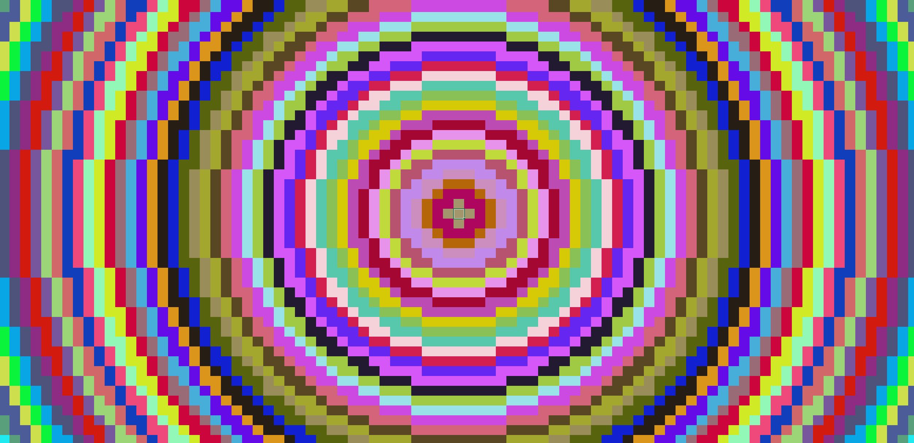

# Random Color Generation and Animated Color Rings

This project contains VBA macros that perform two main functionalities within an Excel workbook:

1. **Random Color Generation for Selected Cells**
2. **Animated Color Rings Expanding from a Selected Cell**

These features are easy to use and create an engaging visual experience in Excel.

## How to Use the Codes

### 1. Download the File

To start, you can download the pre-configured Excel file, named `Rings.xlsm`, which contains all the macros ready to run. This file is a macro-enabled workbook, meaning it allows you to run the VBA code inside.

1. **Download the `Rings.xlsm` file** from the GitHub repository.
2. Open the file in Excel. Ensure that macros are enabled (if not, you will get a warning, and you may need to enable macros manually).

### 2. How to Access the Code in Excel

If you'd like to view or edit the VBA code, follow these steps:

1. Open Excel and the `Rings.xlsm` file.
2. Press **`Alt + F11`** to open the **Visual Basic for Applications (VBA)** editor.
3. In the VBA editor window, you will see three modules (Module 1, Module 2, and Module 3). These contain the code for random color generation and the animated color rings.

### 3. How to Run the Code

There are two main functions you can run, each creating different effects on the cells in the worksheet.

#### A. Random Color Generation for Selected Cells

To use this function:

1. Select a cell or range of cells in the worksheet.
2. In the VBA editor (opened with **`Alt + F11`**), find and execute the macro **`ChangeCellColorRandomly`**. You can run the macro by:
   - Pressing **`Alt + F8`**, selecting `ChangeCellColorRandomly`, and clicking "Run."
3. The selected cells will start changing their background colors randomly over the course of a few seconds.

#### B. Animated Expanding Color Rings

To use the animated color rings:

1. Select a central cell in the worksheet. This will be the starting point for the rings, which will expand outward.
2. In the VBA editor, first run the macro **`GenerateRandomColors`** to generate a list of random colors. This step must be done before running the ring animation.
3. After generating the colors, run the **`CreateRandomColoredRings`** macro to start the animation:
   - Press **`Alt + F8`**, select `CreateRandomColoredRings`, and click "Run."
4. You will see colored rings expanding from the selected cell, filling the surrounding cells with random colors. The animation will repeat several times for a visually appealing effect.

### 4. Customization

The code is pre-configured for a nice visual experience, but you can customize some parameters directly in the VBA code:
- **`numColors`**: Controls the number of color changes for the cells in the `ChangeCellColorRandomly` function.
- **`maxRadius`**: Controls the maximum size of the rings in the `CreateRandomColoredRings` animation.
- **`Delays`**: You can adjust the delay time between color changes to make the animation faster or slower.

---
